# WSL2
WSL2가 나왔다고 한다. 내가 너무 충격적인 짤을 봤었는데
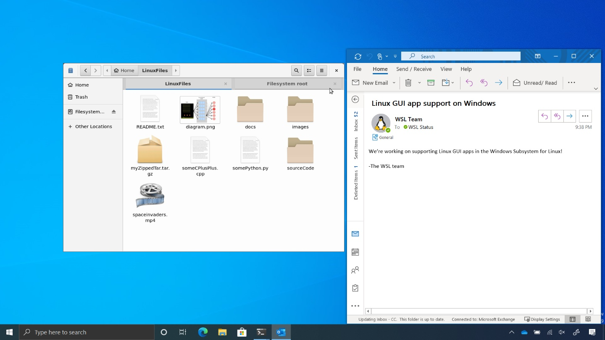

아니 무슨 윈도우 작업표시줄에 그놈이 돌아가는 사진을 보고 만 것이다... 이게 뭔 천인공노할 (엣헴)

아무튼 이런 기이한 광경을 봤으니 WSL2에 대한 기대감이 엄청 부풀어 올랐고 (윈도우가 카카오톡이 되는 터미널 환경이 가능하다니 OSX타도하라) 곧 인사이더 프리뷰로 WSL2가 제공되었다. 바로 당장은 짬이 안나서 (요즘 면접 혼나느라 바빴다) 포스팅 전날에서야 도전하게 되었다.

오늘의 목표는
>**우분투에서 쓰던 개발환경을 WSL2내의 우분투로 이식하는 것**

어짜피 내 개발환경 해봐야 vscode에 git에 docker 도는 거 정도? 인데 code까지 WSL에서 돌릴 필요는 없을 듯 하고, git은 공짜로 딸려오고, docker까지만 이식을 목표로!

공개된지 얼마 안돼서 트러블 슈팅이 많을 것으로 예상한다.

# 1. 윈도우에서의 셋업

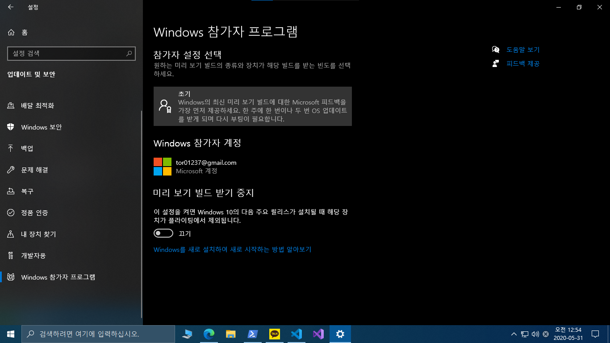

시작 > 설정 > 업데이트 및 보안 > Windows 참가자 프로그램 으로 가서 참가자 설정 선택을 누른다. 만약 여기가 사진처럼 나오지 않거나 초기를 선택 할 수 없는 경우 등(나는 해결을 해서 그 사진을 미처 준비하지는 못했지만) 조금 내려서 1-1 을 보고 해결한 뒤 여기로 다시 와서 진행 할 것

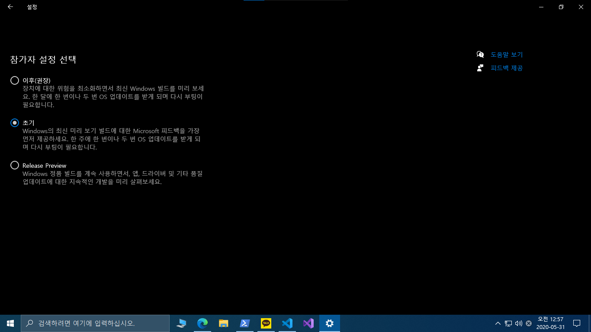

위 사진에서는 초기라고 회색 박스 된 부분을 누르면 라디오 버튼이 있는 선택창으로 들어오게 되고 초기를 누르고 나가면 된다.

## 1-1 선생님 저는 저게 안눌러지는데요?
아마 참가자 프로그램은 진단을 최고 단계로 해야만 가능하다? 같은 멘트가 있어서 피드백 및 진단에서 이를 조정해야 한다.

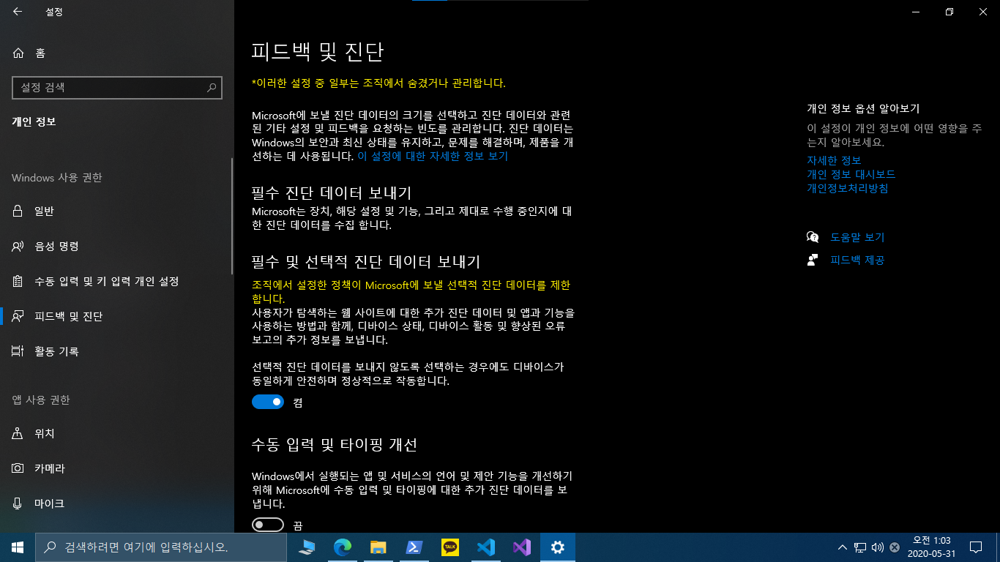

아마 바로 오는 링크가 주어졌겠지만 없다면
> 시작 > 설정 > 개인 정보 > 피드백 및 진단

에 있다.

여기서 조정이 가능한 사람은 바로 3-최대 진단으로 설정해주면되고 사진처럼 빨간(사진에는 노란 글자)

> *이러한 설정 중 일부는 조직에서 숨겼거나 관리합니다.

라는 얼탱이 없는 문구를 만나는 사람들이 있을 것이다. 이 글자가 안뜨고 그냥 설정이 가능한 경우 3-최대 로 설정해주고 위로 돌아가면 되고, 아니면 아래의 1-2를 참조하자.

## 1-2 선생님 저는 조직 생활을 한 적이 없는데요
저도 압니다 그마음, 아무튼 해결을 위해 windows+R 키를 눌러 gpedit.msc을 실행 시켜준다.

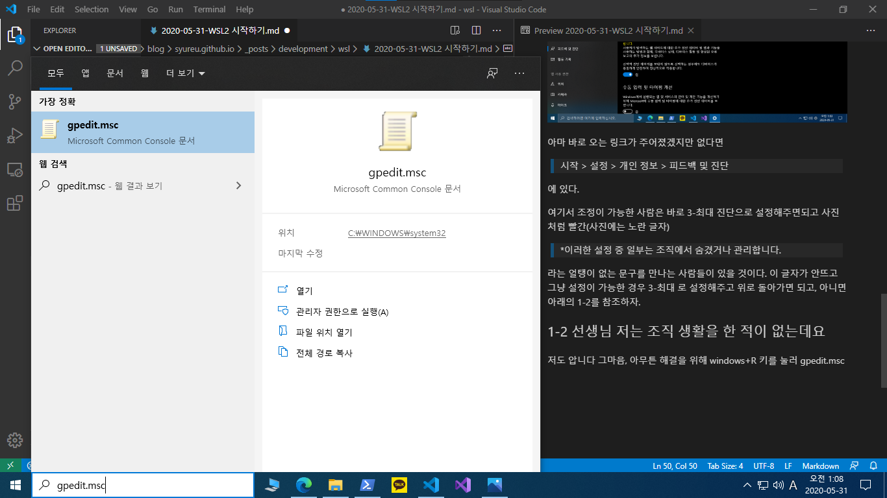
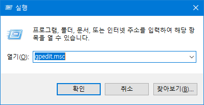

그냥 윈도우키 눌러 검색해도 같다.

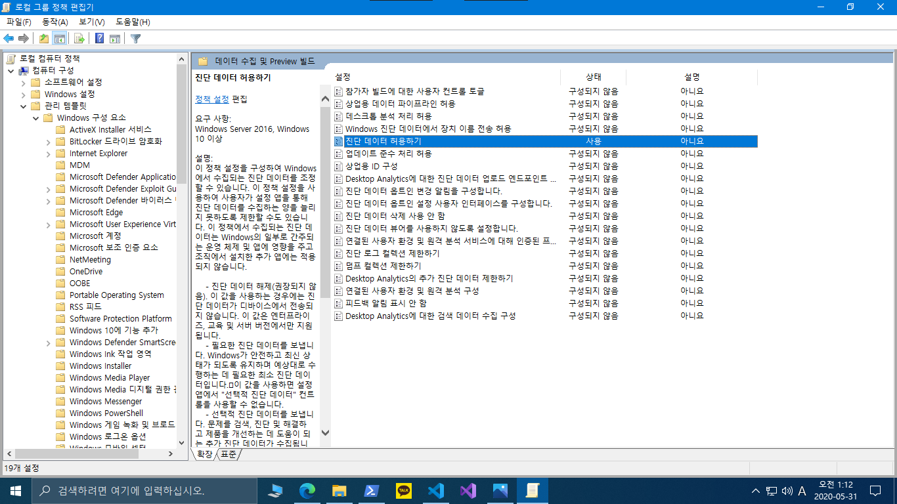

> 컴퓨터 구성 > 관리 템플릿 > Windows 구성 요소 > 데이터 수집 및 Preview 빌드 > 진단 데이터 허용하기

위 옵션을 사용, **추가 진단 데이터 보내기**로 설정한다.
이게 근데 지금 업데이트 하면서 옵션 명이 바뀌었는데 원래는 3-전체 였던 것으로 기억한다. 그리고 저 옵션명도 아마 원격 진단 허용하기? 이런 이름이었던 것 같다. 어쨋든 사용 시 3-전체 혹은 추가 진단 데이터 보내기로 설정해주고 나면 대제목 1에서 '초기'를 선택 할 수 있을 것이다.

# 2. 1이 너무 길어져서 여기서부터
아무튼 초기를 선택하고 나면 그 버튼 바로 아래 혹은 Windows 업데이트 쪽으로 가면 최신 빌드로 업데이트 할 수 있는 버튼이 주어진다.

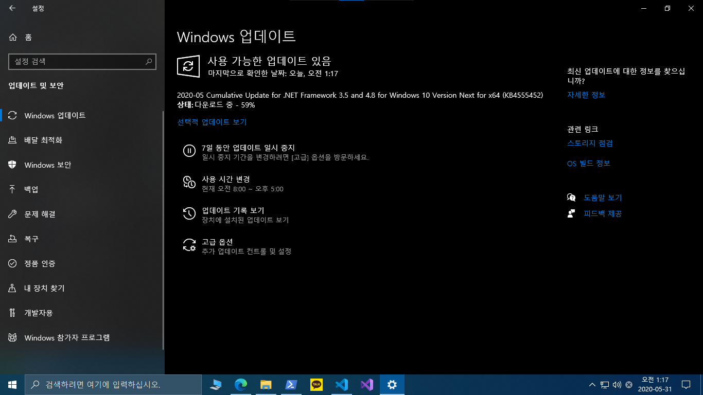

업데이트 확인 버튼을 누르면 윈도우 빌드 10.0.19635.1 같은 것이 뜰 것이다. WSL2는 [여기에 따르면](https://docs.microsoft.com/ko-kr/windows/wsl/install-win10) 10941이상이면 되므로 업뎃을 누르고 다운로드 할 동안 다음을 설정해주자.

## 2-1
PowerShell을 관리자 모드로 실행한다.

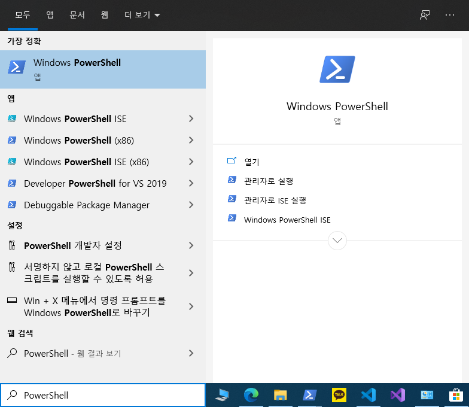

관리자로 실행해야 한다. 그냥 실행하면 어짜피 다음에 처리해줄 명령어를 권한 부족으로 처리못하므로 관리자로 실행하게 되어있다.

파워쉘이 관리자로 켜지만 다음 명령어 입력
> Enable-WindowsOptionalFeature -Online -FeatureName VirtualMachinePlatform

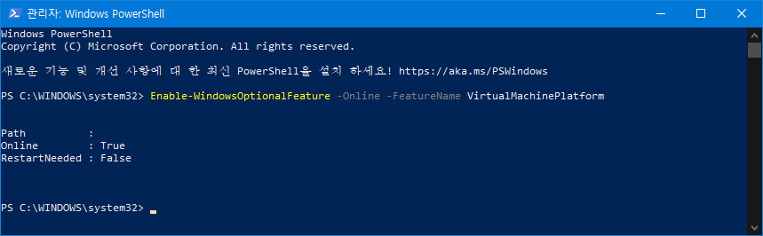

프로그레스바가 슥 지나가고 나면 재부팅 하라고 할 건데 우리는 업뎃을 위해 아직 다운 중 일거고(아마) 하나 더 설정해줘야 되니 재부팅은 잠시 미뤄두자.

## 2-2
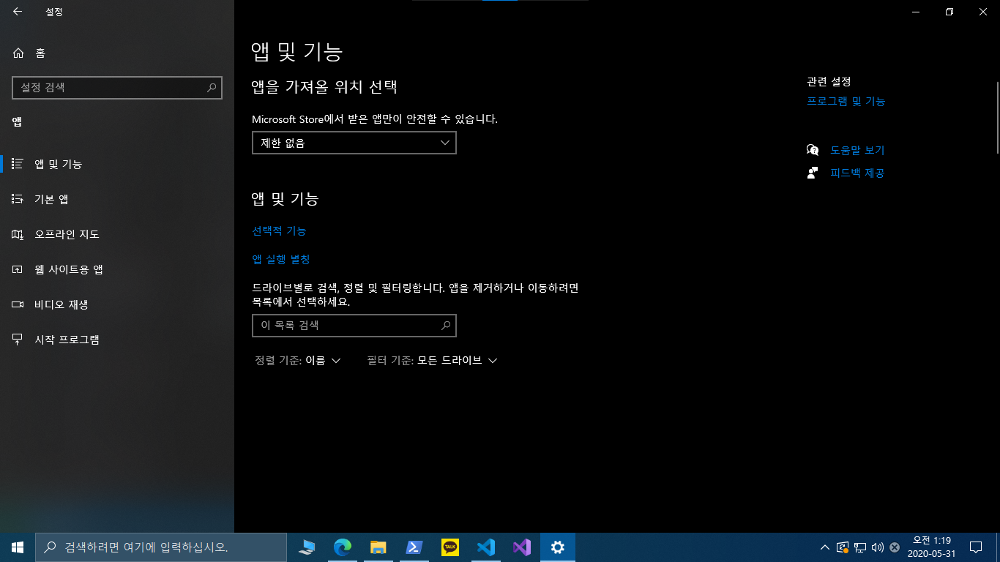

> 시작 > 설정 > 앱 > 앱 및 기능

우측에 보면 '프로그램 및 기능'이 있는데 여기로 들어가자.

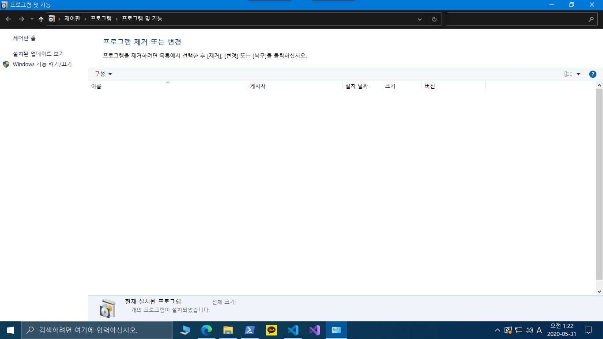

익숙한 프로그램 추가/제거 창이 뜰건데 왼쪽의 'Windows 기능 켜기/끄기'로 들어가자.

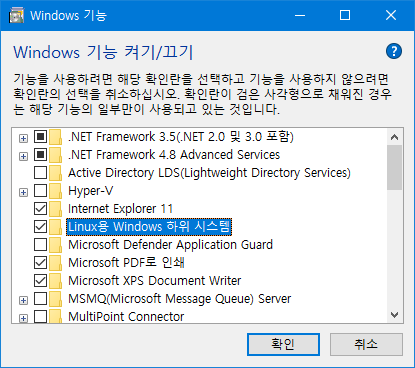

여기서 Linux용 Windows 하위 시스템을 체크해주자, 아까 돌려놓은 업데이트가 다 되면 재부팅을 한다.

## 2-3
재부팅이 완료되고 나면 다음 주소로 접속

[https://aka.ms/wslstore](https://aka.ms/wslstore)

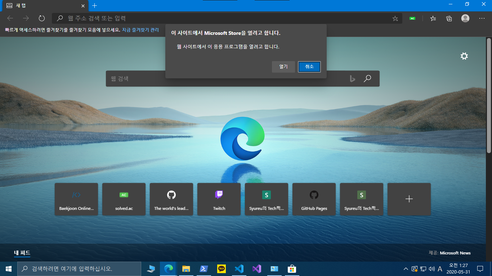

스토어창을 여시겠습니까? 연다.

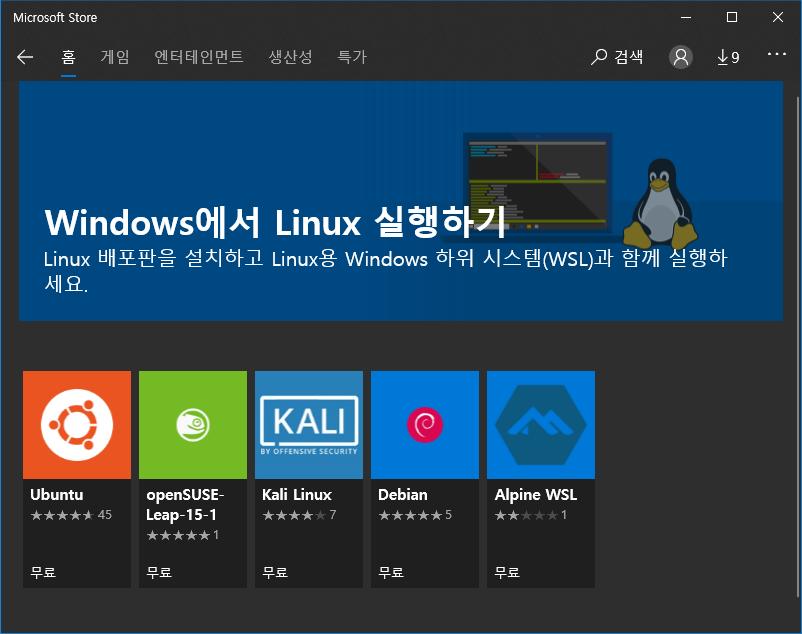

원하는 WSL을 골라서 설치하면 된다. 나는 Ubuntu를 사용하던 환경을 옮길 예정이라 Ubuntu로 진행할 것이고, 다른걸 쓴다면 여러분은 아마 WSL만 헤맸지 리눅스에서는 고인물일 것이므로 알아서 트러블슈팅할 수 있으리라 믿는다. 화이팅!

배포판을 다운 받는 건 어렵지 않다. 다음다음 하면 된다 아무튼!

여기서도 문제가 한번 일어 났던 것 같은데 현재 나는 해결한 상태라 뭔지 기억이 안난다. 아마 어렵지 않게 뭐 그냥 다음다음을 더 해주는 것으로 해결 되었던 것 같다.

# 3. Linux를 설치 다 했다면
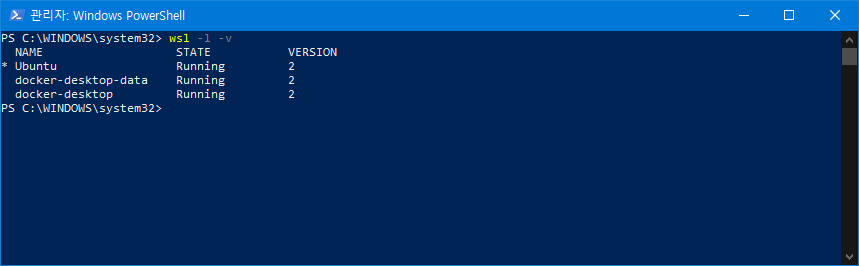

본인이 설치한 배포판을 확인 할 수 있을 것이다. 다음의 명령어를 입력해 기본 실행하는 WSL을 2버전으로 만들자.

> wsl --set-default-version 2

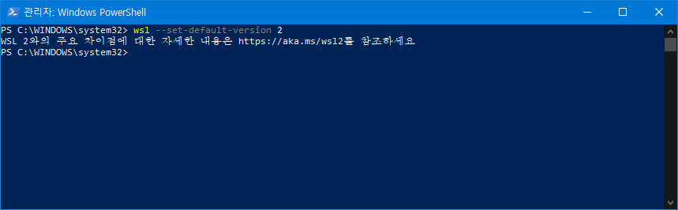

아마 멘트가 더 뜰 것이다 나는 이미 설정이 되었기 때문이다. 이제 WSL로 접속을 할 건데 wsl 명령어 혹은 wsl (배포판) 혹은 (배포판) 으로 접속하면 된다. 나는 ubuntu이므로 아래와 같다.

> wsl

> wsl ubuntu

> ubuntu

아마 디폴트라서 버전이 안나오는 것 같은데(20.04LTS) 버전이 달려 있는 배포판의 경우 wsl -l 에서 나오는 배포판의 이름대로 넣어주어야 된다.

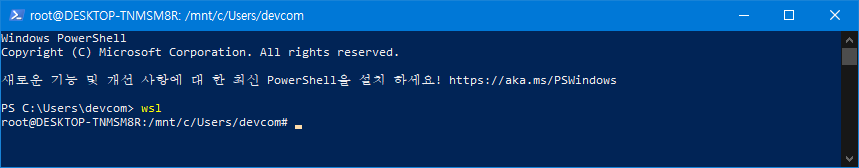

WSL은 여기까지로 마무리 한다. 이후 도커를 꼭 쓰지 않는다면 더 이상 아래의 글을 볼 필요 없이 각자 원하는 대로 셋팅 하면 된다.

# 4. DOCKER 셋업
은 추후에 수정으로 추가할 예정!