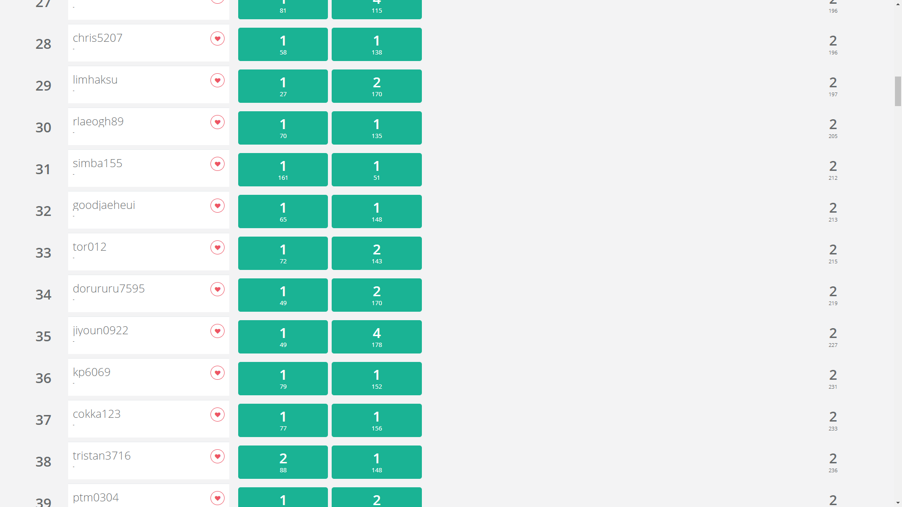
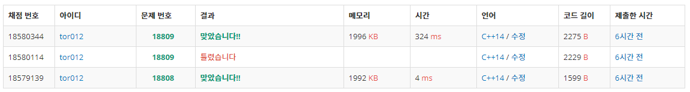

# [2020/03/21 코딩테스트 대비 모의고사 바로가기](https://www.acmicpc.net/contest/view/505)

# 문제 목록
1. 스티커 붙이기 | [문제 링크](https://www.acmicpc.net/problem/18808) | [후기 링크](#1---스티커-붙이기)
2. Gaaaaaaaaaarden | [문제 링크](https://www.acmicpc.net/problem/18809) | [후기 링크](#2---gaaaaaaaaaarden)

# 후기에 앞서
처음 쓰는 블로그 포스트다 보니 경황도 없고 구성도 없다. md문법도 찾아보면서 글을 쓰다보니 원..

# 시험 전
모의고사가 있다는 거는 한 2주 전 정도에 백준 들락날락거리면서 대회탭에 올라온걸 봤고 삼성 역량테스트 A형 모의고사라고 해서(후기 작성 시점 기준으로 아직 A형 한번도 안쳐본 사람...) 풀어봐야지 라는 생각을 하고 있었다.<br>
막상 전날 너무 일찍자고 새벽에 일어나서 프로그래머스 레벨 테스트를 했는데 레벨3까지 다이렉트로 할 뻔 했으나.. 아쉽게 한 10분정도 차이로 못풀었다.<br>
그래서 다시 늦게 잤고 일어나보니 이미 오후 2시 20분정도였다. (대회 시작이 2시) 문제를 읽고나니까 갓-츌리아님은 벌써 투솔브 하셨더라...

# 1 - 스티커 붙이기 ([https://www.acmicpc.net/problem/18808](https://www.acmicpc.net/problem/18808))
문제를 후기 포스팅 작성 시점 기준으로 확인 할 수 없는데(대회 마감의 사유로), 잠결에 읽으면서 들었던 생각
* A형에는 두 문제가 나오는데 보통 상대적으로 쉬운 하나, 그리고 상대적으로 어려운 하나
* 이 문제는 쉬운 하나에 속하며 최근 경향으로는 시뮬레이션인 문제가 주로 나옴
* 그런 트렌드에 잘 맞아 떨어지는 시뮬레이션 문제로 판단

## 용어 정리
맵 : n * m의 스티커를 붙이는 판떼기 (int v[40][40])

## 분석과 접근
문제를 읽어보면 다음과 같다.
1. k개의 스티커를 주어지는 순서대로 붙여보기를 시도한다
2. 최대한 위쪽, 왼쪽편으로 붙이기를 시도하며 빈공간이 있다면 붙인다
3. 만약 해당 모양으로 붙일 수 없다면 90도 시계방향을 돌려 2를 시도
4. 360도 회전 다 할 때 까지 못 붙인다면 스티커는 버린다(예?)
5. 그렇게 주어진 k개의 스티커 중 붙일 수 있는걸 조건대로 다 붙인다면 최종적으로 맵에 몇개의 칸에 스티커가 붙었는가?

시뮬레이션 문제라고 판단한 만큼 분석한 그대로 접근하여 따라해보기를 시도

### 1. main

int main() {
	cin.sync_with_stdio(0); cin.tie(0);
	cin >> n >> m >> k;
	while (k--) {
		cin >> r >> c;
		vector<vector<int>>stk(r);
		for (int i = 0; i < r; ++i) {
			stk[i].resize(c);
			for (int j = 0; j < c; ++j) cin >> stk[i][j];
		}
		for (int i = 0; i < 4; ++i) {
			if (is_can(stk)) {
				do_stk(stk);
				break;
			}
			if (i != 3) stk = turn_stk(stk);
		}
	}
	cout << ans;
}


입력 받고 스티커 들어오는대로 is_can() 함수를 통해 붙일 수 있는지를 판단하고<br>
* 붙일 수 있다면 do_stk()를 통해 붙이고 넘기기
* 붙일 수 없다면 turn_stk()를 통해 90도 회전을 시도. 다만 0도, 90도, 180도, 270도 회전하고도 안된다면 그 스티커는 아예 안되니까 넘기기

### 2. is_can()

bool is_can(vector<vector<int>>& stk) {
	bool flag1 = 0;
	int stkxsize = stk.size();
	for (int i = 0; (i <= n - stkxsize) && !flag1; ++i) {
		int stkysize = stk[0].size();
		for (int j = 0; (j <= m - stkysize) && !flag1; ++j) {
			bool flag2 = 0;
			for (int k = 0; k < stkxsize && !flag2; ++k) {
				for (int l = 0; l < stkysize && !flag2; ++l) {
					if (!stk[k][l])continue;
					if (v[i + k][j + l]) {
						flag2 = 1;
						break;
					}
				}
			}
			if (!flag2) {
				flag1 = 1;
				canx = i;
				cany = j;
				break;
			}
		}
	}
	if (flag1) return true;
	return false;
}


flag1은 스티커를 붙일 수 있나 없나 체크하는 변수<br>
flag2는 i, j 일때 스티커를 붙일 수 있는가 없는가를 나타내는 변수
1. 스티커를 붙일 수 있는가 없는가 확인을 위해 우선 i, j 인덱스를 통해 스티커의 왼쪽 위 지점의 위치를 결정
2. 스티커를 붙이게 되는 우선순위가 위쪽, 왼쪽 순이기 때문에 흔히 2차원 배열을 순회하는 방법 그대로 찾아보다가 나오는 첫번째 가능한 위치가 있다면 거기 붙여주면 된다<br>
3. i, j 마다, 스티커 사이즈만큼 k, l을 통해 스티커를 순회하고
4. 스티커가 없는 자리는(stk[k][l]==0이라면) 확인 할 필요가 없고
5. 스티커가 있는 자리는(stk[k][l]==1) 스티커 붙이는 판떼기의 그자리가 비어있다면 상관이 없다 (flag2==false 유지)
6. 다만 그 자리에 다른 스티커를 이미 붙여놨다면(v[i+k][j+l]==1) 지금의 i, j에서는 스티커를 붙이지 못한다는 것이니 다음 인덱스로 넘어가도록 한다. 이때 flag2=true로해서, 현 위치에 붙이지 못하는 것을 뒤에서 알려주자

결과적으로 is_can() 안에서 i, j 일때 flag2 = false로 유지 되었다면, 이는 스티커를 붙일 자리에 스티커가 없다는 의미로 붙일 수 있다는 의미이다. 붙일 수 있다면 해당 자리에 스티커 붙이기 위해 전역변수 canx, cany로 i, j를 넘겨주고 이 함수가 true를 반환 할 수 있도록 하자.<br>
만약 i, j를 다 돌았는데도 flag1 = false라면 어떤 i, j에서도 스티커를 붙일 수 없다는 의미이고, false를 통해 붙일 수 없음을 리턴하자.<br>

i, j, k, l 의 인덱스를 조정하는게 힘들다면 인덱스를 쪼물딱 대는 연습을 많이 해보자. 물론 이 문제에서 가장 어려운 부분은 여기가 아니지만.. 여기도 힘들다면 이차원 배열과 구현, 시뮬레이션 계열 문제를 많이 접해 인덱스를 원하는대로 굴리는 것에 익숙해지는게 좋다.

### 3.do_stk()

void do_stk(vector<vector<int>>& stk) {
	for (int i = 0; i < stk.size(); ++i) {
		for (int j = 0; j < stk[0].size(); ++j) {
			if (stk[i][j]) {
				v[canx + i][cany + j] = 1;
				ans++;
			}
		}
	}
}


메인에서 is_can()을 통해 붙일 수 있다면 do_stk()를 호출해 실제로 붙여주는 작업을 하자. 말그대로 스티커 범위를 돌면서 스티커가 있는 자리면 실제 맵에 붙이는 처리를 해준다.

붙이는 처리를 다 한다음 전체 맵에서 몇개 붙었나 세도 아무 상관이 없지만, 이 문제는 붙이기만 하면 끝까지 해당 스티커 갯수에는 변동이 없어서 붙일 때마다 한장씩 카운팅 해줬다. (사실 끝나고 2차원 배열 순회하기가 귀찮았다는게 학계의 정설이다)

### 4. turn_stk()

vector<vector<int>> turn_stk(vector<vector<int>>& stk) {
	vector<vector<int>>turned(stk[0].size());
	for (int i = 0; i < turned.size(); ++i) turned[i].resize(stk.size());
	for (int i = 0; i < turned.size(); ++i) {
		for (int j = 0; j < turned[0].size(); ++j) {
			turned[i][j] = stk[stk.size() - 1 - j][i];
		}
	}
	return turned;
}


스티커를 붙일 수가 없어서 90도를 회전할 경우 turn_stk()를 호출한다. 돌리기가 실제로는 자주 할 일이 없는데 A형에서는 기출도 있고 어느정도 그냥 해야하는 테크닉으로 보인다.(자매품 배열회오리도 있다)<br>
정처기 등에서 알고리즘 파트를 공부하면 2차원 배열 5*5를 시계방향으로 돌려라 같은 문제가 있는데 이러한 문제는 보통 N * N 이라 인덱스 조절이 어렵지 않은데 위 문제, 그리고 삼성 기출등은 N * M의 배열을 돌리는 경우가 있다.<br>
N * M을 90도로 돌리면 <b>M * N</b>가 된다. 주의하자. 대부분 r, c로 스티커의 크기를 받았을 텐데 그렇다면 c, r로 동작하도록 바꿔줘야 된다. 이 부분에서 실수해서 틀린사람이 꽤 있다고 바킹독님 해설 강의때 봤다.

나는 회전한 stk를 새로 만들어서 stk에 덮었기 때문에 아래의 코드들에서도 r, c가 아닌 stk.size(), stk[0].size()를 인덱스 범위 잡는데 기준으로 사용했다.

그리고 실제로 돌리는 파트
```
turned[i][j] = stk[stk.size() - 1 - j][i];
```
일단 이문제 풀때는 종이에 인덱스 적어가면서 규칙을 찾았다.<br>
나도 이런걸 다 외우면서 하지는 않는데 막상 필요할 때 할려고 하면 잘 안나온다. 더군다나 N * N 같은 깔끔한 배열도 아니고 N * M 등이면 인덱스가 굉장히 커찮다. 90도 시계 반시계등은 레퍼런스를 준비하는것도 A형 대비로 좋은게 아닐까 싶다.

## 소스

#include<iostream>
#include<vector>
using namespace std;
int n, m, k, r, c, v[40][40], canx, cany, ans;
vector<vector<int>> turn_stk(vector<vector<int>>& stk) {
	vector<vector<int>>turned(stk[0].size());
	for (int i = 0; i < turned.size(); ++i) turned[i].resize(stk.size());
	for (int i = 0; i < turned.size(); ++i) {
		for (int j = 0; j < turned[0].size(); ++j) {
			turned[i][j] = stk[stk.size() - 1 - j][i];
		}
	}
	return turned;
}
void do_stk(vector<vector<int>>& stk) {
	for (int i = 0; i < stk.size(); ++i) {
		for (int j = 0; j < stk[0].size(); ++j) {
			if (stk[i][j]) {
				v[canx + i][cany + j] = 1;
				ans++;
			}
		}
	}
}
bool is_can(vector<vector<int>>& stk) {
	bool flag1 = 0;
	int stkxsize = stk.size();
	for (int i = 0; (i <= n - stkxsize) && !flag1; ++i) {
		int stkysize = stk[0].size();
		for (int j = 0; (j <= m - stkysize) && !flag1; ++j) {
			bool flag2 = 0;
			for (int k = 0; k < stkxsize && !flag2; ++k) {
				for (int l = 0; l < stkysize && !flag2; ++l) {
					if (!stk[k][l])continue;
					if (v[i + k][j + l]) {
						flag2 = 1;
						break;
					}
				}
			}
			if (!flag2) {
				flag1 = 1;
				canx = i;
				cany = j;
				break;
			}
		}
	}
	if (flag1) return true;
	return false;
}

int main() {
	cin.sync_with_stdio(0); cin.tie(0);
	cin >> n >> m >> k;
	while (k--) {
		cin >> r >> c;
		vector<vector<int>>stk(r);
		for (int i = 0; i < r; ++i) {
			stk[i].resize(c);
			for (int j = 0; j < c; ++j) cin >> stk[i][j];
		}
		for (int i = 0; i < 4; ++i) {
			if (is_can(stk)) {
				do_stk(stk);
				break;
			}
			if (i != 3) stk = turn_stk(stk);
		}
	}
	cout << ans;
}


## 나를 위한 정리
1. A형 대비용 2차원 배열 회전 레퍼런스 구축

<br><br><br><br><br>

# 2 - Gaaaaaaaaaarden
## [https://www.acmicpc.net/problem/18809](https://www.acmicpc.net/problem/18809)
1번을 원트에 풀어서 생각보다는 순조로웠다. 삼성 역량테스트 A형 유형을 흉내를 냈다면 이 문제는 상대적으로 어려운 <b>"상황을 구성하고 그 상황에서 탐색을 하는"</b> 문제인 것을 미리 생각하고 읽어 봤다.

## 용어 정리
맵 : n * m의 지도 데이터(int v[50][50])

## 문제 분석
1. 맵에 호수, 그냥 땅, 배양액을 뿌릴 수 있는 땅이 각각 0, 1, 2로 주어진다
2. g 만큼의 녹색 배양액과 r 만큼의 적색 배양액을 받는다.
3. 배양액을 뿌릴 수 있는 땅에만 배양액을 하나만 뿌릴 수 있다.
4. 배양액은 1초에 상하좌우 한칸씩 퍼져 나간다. 다만 호수, 다른 배양액이 이미 있는 경우, 꽃이 있는 경우는 불가능하다. 즉 배양액을 뿌릴 수 있지만 안뿌린 자리와 그냥 땅에만 퍼져 나간다는 것이다.
5. r, g배양액이 동시에(같은 초에) 같은 칸으로 퍼지는 순간 꽃이 된다. 꽃이 되면 배양액은 없어지고 더 이상 그 칸을 지나서 퍼질 수 없다.
6. 주어진 조건에 따라 배양액을 뿌려보고 꽃의 개수 최대값을 구하라.

삼성 역량테스트 A형의 "어려운" 유형에 잘맞는 문제이면서 좀 어려웠다. 나는 포스팅 시점 기준 A형을 실제로 쳐본적이 없어서 기출이 복기된 문제들만 풀어봤는데, 구현을 너무 어렵게 만드는 문제들이 있었던 것 같다. 이 문제는 구현 난이도가 아주 어렵진 않으나 좀 있으면서 역테 트렌디함을 잘 갖춘 문제같다.<br>
내가 말하는 이 "어려운" 문제의 트렌디함이 다음과 같다.
* 문제에서 상황이 주어지고, 구성할 수 있는 모든 상황에서 탐색 혹은 시뮬레이션을 하여 어떤 결과, 최댓값, 최솟값 등을 도출

이 문제도 잘 보면 배양액을 뿌릴 수 있는 상황(경우의 수)가 여럿 만들어짐을 알 수 있다. 그러한 여러 경우의 수 중 꽃이 피는 최댓값을 찾아야 한다.

## 접근
1. 우선 배양액을 뿌릴 수 있는 공간을 선택해야 한다.<br>
문제에서 배양액을 뿌릴 수 있는 땅이 r + g 이상으로 주어진다. 딱맞게가 아니라. 다만 제한은 r + g가 최대 10이므로 10 C r+g 이다.

2. 배양액을 뿌릴 땅이 선택 되었으면 r과 g 배양액을 각각 어디에 뿌릴 지 결정해야 한다.<br>
경우는 r+g C r 혹은 r+g C g이다. 땅이 r + g 만큼 선택 되었고, 그중 r개를 골랐다면 나머지는 g가 그냥 들어갈 수 밖에 없다.

3. r, g가 놓일 공간이 결정 되었다면 bfs로 시뮬레이션 한다.<br>
우선 배양액이 <b>퍼져나가는 것</b>과 퍼져나간 시간에 따라 처리된다는 것 때문에 bfs로 탐색을 했다. dfs의 경우 어떤 지점까지의 도착 최소 시간(최소 거리)를 구할 수는 있지만 매우 비효율적이고 백트래킹을 시켜야 최소지점이 잘 구해지게 되므로 중복방문이 매우 많이 발생, n, m이 커지면 걷잡을 수 없다.

4. 꽃의 갯수를 카운팅해서 최대값이면 갱신

접근은 1234만 보면 쉬워보이지만 구현이 좀 어려웠다.

### 1. 배양액을 뿌릴 수 있는 공간 선택

// struct A { int a, x, y; };
for (int i = 0; i < n; ++i) for (int j = 0; j < m; ++j) {
    cin >> v[i][j];
    if (v[i][j] == 2) water.push_back({ k++,i,j });
}


배열을 입력 받다가 배양액을 뿌릴 수 있는 공간이면 카운팅을 했다. 이 부분은 이미지로 보여주는게 설명하기 편할 듯?


vector<int>rand_choicer(water.size());
for (int i = 0; i < g + r; ++i) rand_choicer[i] = 1;


이제 어느 땅에다가 뿌릴 지 골라야 하는데 permutation으로 조합을 만드는 트릭을 사용했다.<br>
배양액을 뿌릴 수 있는 땅을 우리는 바로 위에서 번호를 매겨놨다. 그중 어떤 번호를 고르겠다면 1, 고르지 않겠다면 0으로 나타내는 것이다. 

### 2. 배양액을 뿌리기로 한 땅에 어떤 배양액을 뿌릴지 선택

vector<char>seq;
for (int i = 0; i < g; ++i) seq.push_back('g');
for (int j = 0; j < r; ++j) seq.push_back('r');


문제 풀이 가장 앞서서 이러한 seq 배열을 만들어 주는데, g = 2, r = 1과 같은 식이면 seq[0] = 'g', seq[1] = 'g', seq[2] = 'r' 와 같은 상태로 초기화 시켜준다. 이 배열의 의미는 배양액 뿌릴 수 있는 칸 0번은 g를 뿌리고 1번은 g를 뿌리고 2번엔 r을 뿌리겠다는 의미이다. next_permutation을 돌려주면 grg 순으로 변경되므로(g가 r보다 아스키 값이 작으니) next_permutation 있는 만큼 돌려보면 모든 g와 r을 뿌리는 경우의 수를 만들 수 있다.

### 3. bfs 시뮬레이션

do {
	do {
		C visit[50][50] = { {{'\0',0}} };
		tmp = 0;
		queue<B>q;
		int choicenum = -1;
		while (1) if (rand_choicer[++choicenum])break;
		for (int i = 0; i < g + r; ++i) {
			q.push({ seq[i],0,water[choicenum].x,water[choicenum].y });
			if (seq[i] == 'g') visit[water[choicenum].x][water[choicenum].y].color += 1;
			else if (seq[i] == 'r') visit[water[choicenum].x][water[choicenum].y].color += 2;
			if(i!=g+r-1) while (1) if (rand_choicer[++choicenum])break;
		}
		while (!q.empty()) {
			B b = q.front(); q.pop();
			if (visit[b.x][b.y].color == 4) continue;
			for (int i = 0; i < 4; ++i) {
				int nx = b.x + dx[i], ny = b.y + dy[i];
				if (0 <= nx && nx < n && 0 <= ny && ny < m) {
					if (!v[nx][ny]) continue;
					if (visit[nx][ny].color == 4) continue;
					if (!visit[nx][ny].color) {
						q.push({ b.color,b.depth + 1,nx,ny });
						if (b.color == 'g') visit[nx][ny].color += 1;
						else if (b.color == 'r') visit[nx][ny].color += 2;
						visit[nx][ny].depth = b.depth + 1;
					}
					else if (visit[nx][ny].color == 1 && b.color == 'r' && b.depth+1 == visit[nx][ny].depth) {
						visit[nx][ny].color = 4;
						tmp++;
					}
					else if (visit[nx][ny].color == 2 && b.color == 'g' && b.depth+1 == visit[nx][ny].depth) {
						visit[nx][ny].color = 4;
						tmp++;
					}
				}
			}
		}
		if (ans < tmp) ans = tmp;
	} while (next_permutation(seq.begin(), seq.end()));
} while (prev_permutation(rand_choicer.begin(), rand_choicer.end()));


아.. 코드만 봐도 현자타임이 진하게 온다<br>
하나씩 뜯어 보자.

1. 가장 바깥 do while은 rand_choicer를 돌린다.<br>
아까 우리는 [이렇게](#link1) 1로 뿌릴 곳 0으로 안뿌릴 곳을 선택하기 위한 배열을 만들어 뒀다.<br>
그리고 내림차순 순열을 돌리기 때문에 11100, 11010, 11001, ... , 00111 까지 배양액을 뿌릴 수 있는 땅 중에서 어떤 땅을 고를지 모든 경우의 수를 만들 수 있다.

2. 그 바로 안 do while은 g, r 배양액이 각각 놓일 위치를 돌려준다.<br>
마찬가지로 gggrr, ggrgr, ggrrg, ... , rrggg 까지 모든 경우를 만들 수 있다.

3. 이제 모든 상황이 구성되었으므로 시뮬레이션 하는 부분이다.<br>
visit는 두개의 int로 된 C 구조체를 사용했다. 이 문제는 단순히 방문만 처리하면 되는게 아니다.<br>
```
한 큐로 bfs를 돌리기 때문에 시뮬레이션 상 같은 지점에 동시에 g, r배양액이 퍼지는 것을 나타 낼 수가 없다.
```
즉 g 배양액이 퍼지는 것에 대한 처리가 되고나면, r 배양액이 퍼지는 것에 대한 처리가 순서대로 일어난다. (초기 큐에 넣어준 순서에 따라) 그래서 만약 방문만 했다는 정보만 가지고 있다면 해당 배양액이 언제 그 칸에 도착했는지 모르기 때문에 다른 배양액이 그 칸에 접근 헀을 때 꽃이 될지, 혹은 시간이 달랐기 때문에 접근 할 수 없는지 알 수가 없다는 말이다.<br>
이러한 문제를 해결하기 위해 우리는 방문지점에 방문사실을 나타내면서 그 방문이 몇 초에 이루어 졌는지를 나타낼 것이다! 그게 C 구조체의 depth 변수가 할 역할이다.

4. bfs 돌리기 위한 시작 포인트를 넣어준다.
   

/*
struct B {
	char color;
	int depth, x, y;
};
*/
queue<B>q;
int choicenum = -1;
while (1) if (rand_choicer[++choicenum])break;
for (int i = 0; i < g + r; ++i) {
    q.push({ seq[i],0,water[choicenum].x,water[choicenum].y });
    if (seq[i] == 'g') visit[water[choicenum].x][water[choicenum].y].color += 1;
    else if (seq[i] == 'r') visit[water[choicenum].x][water[choicenum].y].color += 2;
    if(i!=g+r-1) while (1) if (rand_choicer[++choicenum])break;
}


choicenum은 rand_choicer에서 인덱스를 나타내기위해 썼다. 우리는 1을 배양액 뿌릴 땅, 0을 배양액 안뿌릴 땅으로 골랐기 때문에 1만 가리키도록 해줬다.<br>
그리고 방문을 나타내는 곳에 내 나름의 규칙을 세웠는데.

* g 배양액이 방문한 곳은 C.color에 1을 쓴다.
* r 배양액이 방문한 곳은 C.color에 2를 쓴다.
* 꽃이 핀 곳은 C.color에 4를 쓴다.

원래는 비트마스킹하려고 해서 1, 2, 3을 할려고 했는데 왜 이렇게 된거지..

셋팅 다된 bfs가 실제로 도는 부분


while (!q.empty()) {
B b = q.front(); q.pop();
if (visit[b.x][b.y].color == 4) continue;
for (int i = 0; i < 4; ++i) {
    int nx = b.x + dx[i], ny = b.y + dy[i];
    if (0 <= nx && nx < n && 0 <= ny && ny < m) {
        if (!v[nx][ny]) continue;
        if (visit[nx][ny].color == 4) continue;
        if (!visit[nx][ny].color) {
            q.push({ b.color,b.depth + 1,nx,ny });
            if (b.color == 'g') visit[nx][ny].color += 1;
            else if (b.color == 'r') visit[nx][ny].color += 2;
            visit[nx][ny].depth = b.depth + 1;
        }
        else if (visit[nx][ny].color == 1 && b.color == 'r' && b.depth+1 == visit[nx][ny].depth) {
            visit[nx][ny].color = 4;
            tmp++;
        }
        else if (visit[nx][ny].color == 2 && b.color == 'g' && b.depth+1 == visit[nx][ny].depth) {
            visit[nx][ny].color = 4;
            tmp++;
        }
    }
}
}


순서대로 보자.<br>

1. 큐를 깐다
2. 지금 지점이 꽃이면 배양액이 지나서 퍼질 수 없기 때문에 스킵한다
3. 4방지점을 탐색하는데 맵 범위 안이면서<br>
* v[nx][ny] == 0 이라면 (호수 라면) 스킵
* visit[nx][ny].color == 4 라면 (꽃이라면) 스킵
4. 그외 스킵이 안됐으면 다음과 같은 사항을 확인해 보는데<br>
```
visit[nx][ny].color == 0 이라면 (g도 r도 꽃도 없는 곳이라면)
```
지금 도착한 배양액으로 이칸을 덮어준다.
depth도 퍼지기 전 배양액 +1로 기록
```
visit[nx][ny].color ==1 이면서 (여기 g 배양액이 방문했으면서)
b.color =='r' 이면서 (나는 r 배양액 이면서)
b.depth+1 == visit[nx][ny].depth 이면 (내가 퍼졌을 때의 시간과 그 자리에 배양액이 퍼진 시간이 같으면)
```
위 세가지 조건을 만족하면 같은 칸에 같은 시간에 r, g 배양액이 접근한 것으로 보고 꽃을 만든다.<br>
(visit[nx][ny].color = 4)<br>
그리고 tmp는 현재 상황의 꽃의 갯수를 나타내는데 꽃이 만들어 졌으므로 tmp++<br>
방금은 g 배양액이 간 곳에 r 이 접근한 상황이므로 반대의 것도 만들어 주면 된다.
5. 큐가 비었으면 돌 수 있는곳 다돌았다는 것으로 tmp가 최댓값이라면 ans 갱신

끝!

## 소스

#include<iostream>
#include<vector>
#include<algorithm>
#include<queue>
using namespace std;
int n, m, g, r, v[50][50], ans, tmp,
dx[4] = { -1, 0, 1, 0 }, dy[4] = { 0, 1, 0, -1 };
struct A {
	int a, x, y;
};
struct B {
	char color;
	int depth, x, y;
};
struct C {
	int color, depth;
};
vector<A>water;
void go() {
	vector<char>seq;
	for (int i = 0; i < g; ++i) seq.push_back('g');
	for (int j = 0; j < r; ++j) seq.push_back('r');
	vector<int>rand_choicer(water.size());
	for (int i = 0; i < g + r; ++i) rand_choicer[i] = 1;
	do {
		do {
			C visit[50][50] = { {{'\0',0}} };
			tmp = 0;
			queue<B>q;
			int choicenum = -1;
			while (1) if (rand_choicer[++choicenum])break;
			for (int i = 0; i < g + r; ++i) {
				q.push({ seq[i],0,water[choicenum].x,water[choicenum].y });
				if (seq[i] == 'g') visit[water[choicenum].x][water[choicenum].y].color += 1;
				else if (seq[i] == 'r') visit[water[choicenum].x][water[choicenum].y].color += 2;
				if(i!=g+r-1) while (1) if (rand_choicer[++choicenum])break;
			}
			while (!q.empty()) {
				B b = q.front(); q.pop();
				if (visit[b.x][b.y].color == 4) continue;
				for (int i = 0; i < 4; ++i) {
					int nx = b.x + dx[i], ny = b.y + dy[i];
					if (0 <= nx && nx < n && 0 <= ny && ny < m) {
						if (!v[nx][ny]) continue;
						if (visit[nx][ny].color == 4) continue;
						if (!visit[nx][ny].color) {
							q.push({ b.color,b.depth + 1,nx,ny });
							if (b.color == 'g') visit[nx][ny].color += 1;
							else if (b.color == 'r') visit[nx][ny].color += 2;
							visit[nx][ny].depth = b.depth + 1;
						}
						else if (visit[nx][ny].color == 1 && b.color == 'r' && b.depth+1 == visit[nx][ny].depth) {
							visit[nx][ny].color = 4;
							tmp++;
						}
						else if (visit[nx][ny].color == 2 && b.color == 'g' && b.depth+1 == visit[nx][ny].depth) {
							visit[nx][ny].color = 4;
							tmp++;
						}
					}
				}
			}
			if (ans < tmp) ans = tmp;
		} while (next_permutation(seq.begin(), seq.end()));
	} while (prev_permutation(rand_choicer.begin(), rand_choicer.end()));
}
int main() {
	cin.sync_with_stdio(0); cin.tie(0);
	cin >> n >> m >> g >> r;
	int k = 0;
	for (int i = 0; i < n; ++i) for (int j = 0; j < m; ++j) {
		cin >> v[i][j];
		if (v[i][j] == 2) water.push_back({ k++,i,j });
	}
	go();
	cout << ans;
}


## 나를 위한 정리
1. 처음에 내가 조합+순열 이라고 헷갈렸는데 사실 조합+조합이다.
2. 정직한 입력 범위, 정직한 조합 상황 1, 정직한 조합 상황 2, 내가 박은 언어가 c++ 이라는게 다 물려서 permutation을 썼다. 뭐 나쁜건 아닌데...<br>
배양액 뿌릴 수 있는 땅을 결정하는 것과 그 땅에 g, r 중 어떤 배양액을 뿌릴 수 있는지를 백트래킹으로 구성 할 수 있다. 근데 이건 너무 정직해서 그냥 permutation쓰는게 좋아 보임

# 결과

## 33등!
2번 투트했는데, 모의고사 시작하고 30분정도 있다가 참전해서, 종료 시간이 5시인데 4시로 헷갈려서... 3시 57분? 58분에 테케도 틀리게 나왔지만 아까워서 제출했다.. 당연히 틀렸고<br>
근데 생각해보니 A형 시험이 3시간인데.. 모고시간도 5시까지였던거임 (ㄴㅇㄱ)
4시 3분에 수정해서 제출해서 맞았다(:blobinsaeng:)



# 마무리
md 파일 포스팅을 처음해보다 보니 너무 길어진 걸까 대회 실제 참전했던 1시간 40여분 보다 포스팅 시간만 두 배는 든것 같다. 문법도 찾아보고, ps포스팅이 처음이라 구성도 고민하고 어떻게 쓸지도 고민하다보니 그런가.. 앞으로 생산성 있게 포스팅 하는법도 생각좀 해봐야 꾸준히 할 수 있을 듯 하다.